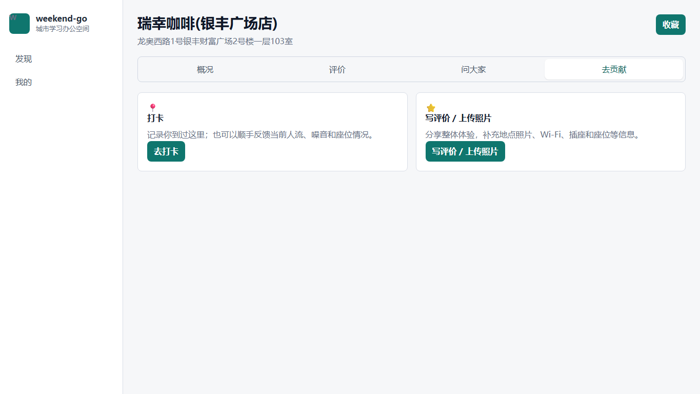
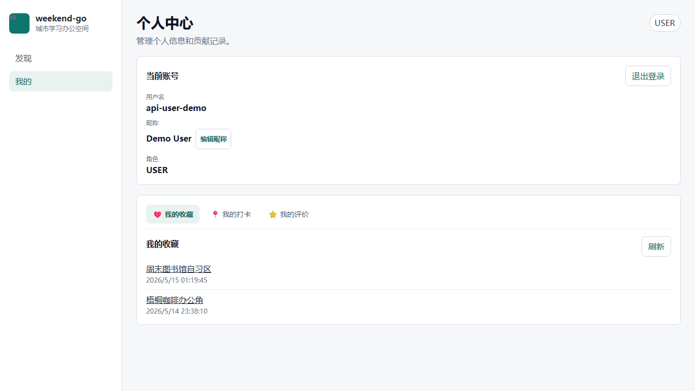

# 城市学习办公空间共建平台：服务开发技术项目报告

> 课程：服务开发技术  
> 项目：weekend-go  
> 文档版本：V1.1  
> 编写日期：2026-06-05  
> 说明：本文档基于当前项目实现编写，页面截图已补充到 `docs/screenshot/`。

---

## 1. 项目背景与服务场景

### 1.1 项目背景

在学习、备考、阅读、远程办公和临时办公场景中，用户经常需要寻找附近适合长时间停留的空间。普通地图服务能够提供地点名称、地址、距离和基础分类，但很难回答以下问题：

- 这里是否安静？
- Wi-Fi 是否稳定？
- 插座是否充足？
- 是否适合久坐？
- 当前是否拥挤？
- 有没有近期真实用户反馈？

weekend-go 将“城市学习办公空间”作为垂直服务场景，在高德地图 POI 数据的基础上，引入用户评价、地点照片、打卡反馈和管理员审核机制，形成面向学习办公场景的资源服务。

### 1.2 项目目标

本项目目标不是简单制作地图页面，而是围绕学习办公空间建立一组可访问、可组合、可验证的 RESTful 资源服务：

- 使用高德地图 Web 服务 API 获取候选地点。
- 将外部 POI 与本地共建数据合并为地点资源。
- 在附近模式中以浏览器定位坐标作为地图中心点，即使暂无地点结果也保留地图基础视图，避免用户进入空白状态。
- 支持用户登录后打卡、评价、上传照片、收藏和问答。
- 支持管理员审核评价和图片，保证公开数据基本可信。
- 提供 Vue 客户端作为服务消费端，并通过 Postman/测试命令验证接口。

### 1.3 用户角色与业务闭环

| 角色 | 主要目标 | 典型操作 |
|------|----------|----------|
| 普通用户 | 找到适合学习办公的地点 | 搜索地点、查看详情、打卡、写评价/上传照片、收藏、提问/回答 |
| 管理员 | 维护共建内容质量 | 查看待审核评价/图片、通过或驳回内容 |

当前业务闭环如下：

```text
用户搜索或查看附近地点
  -> 系统合并高德 POI 与本地数据
  -> 用户进入地点详情页
  -> 用户打卡或写评价/上传照片
  -> 管理员审核评价和图片
  -> 审核通过内容进入地点详情展示和长期画像聚合
  -> 其他用户基于更新后的数据选择地点
```


---

## 2. 资源分析与数据模型

### 2.1 核心资源

| 资源 | 服务含义 | 当前实现 |
|------|----------|----------|
| 用户资源 | 系统账号、角色、昵称 | 注册、登录、当前用户、昵称修改 |
| 地点资源 | 学习办公空间候选地点 | 高德 POI 入库、本地详情、地图 marker |
| 打卡资源 | 到访记录和可选实时状态反馈 | 拥挤度、噪音、是否有座、备注 |
| 评价资源 | 长期体验和主要共建入口 | 多维评分、文字评价、客观属性、图片绑定 |
| 图片资源 | 地点照片 | 随评价提交或独立图片接口，进入审核 |
| 问答资源 | 地点相关提问与回答 | 问大家 tab |
| 收藏资源 | 用户收藏地点 | 收藏、取消收藏、我的收藏 |
| 审核资源 | 管理员处理待审核内容 | 待审核列表、统计、通过/驳回 |

### 2.2 外部资源与本地资源关系

项目使用高德地图 Web 服务 API 获取地点基础信息，包括地点名称、地址、经纬度和 POI 类型。本地系统不直接把高德分类等同于学习办公空间分类，而是通过用户评价、照片和打卡逐步沉淀场景化数据。

```text
高德 POI
  -> places 基础地点
  -> reviews / place_images / checkins / place_qa / favorites
  -> 地点详情资源表述
```

### 2.3 当前共建口径

当前项目已经从第一版规格书中的“独立属性共建提交”演化为更简洁的模型：

- 打卡 = 到访记录 / 可选实时状态反馈，不作为主要共建入口。
- 写评价 / 上传照片 = 主要共建入口，评价、评分、地点图、客观属性都从这里进入。
- 长期画像主要由审核通过的评价数据聚合。
- 实时状态可由最近打卡反馈聚合。
- 打卡当前不支持上传图片，避免扩大审核和数据模型复杂度。

### 2.4 核心数据库表

| 表 | 作用 |
|----|------|
| `users` | 用户账号、密码哈希、角色、昵称 |
| `places` | 地点基础信息、高德 POI 标识、位置与状态 |
| `workspace_profiles` | 地点长期画像聚合结果 |
| `checkins` | 用户打卡和实时状态反馈 |
| `reviews` | 评价、评分、客观属性、审核状态 |
| `place_images` | 地点图片，可绑定评价 |
| `favorites` | 用户收藏地点 |
| `place_qa` | 问大家的问题与回答 |
| `review_likes` | 评价点赞关系 |
| `review_replies` | 评价回复 |
| `audit_logs` | 管理员审核日志 |

图表占位：数据库核心表关系图，后续可补充 ER 图或资源关系图。

---

## 3. RESTful 服务设计

### 3.1 URI 设计原则

项目接口遵循资源导向原则：

- URI 使用名词描述资源。
- HTTP 方法表达操作。
- JSON 作为统一资源表述格式。
- 写操作需要登录，管理员接口需要 ADMIN 角色。
- 统一响应结构便于前端和 Postman 验证。

### 3.2 主要服务接口

| 资源类别 | 方法 | URI | 说明 | 权限 |
|----------|------|-----|------|------|
| 健康检查 | GET | `/api/health` | 后端服务状态 | 公开 |
| 用户认证 | POST | `/api/auth/register` | 用户注册 | 公开 |
| 用户认证 | POST | `/api/auth/login` | 用户登录 | 公开 |
| 用户认证 | GET | `/api/auth/me` | 当前用户信息 | 登录 |
| 地点发现 | GET | `/api/workspaces/search` | 关键词搜索地点 | 公开接口，前端当前强制登录访问页面 |
| 地点发现 | GET | `/api/workspaces/nearby` | 附近地点搜索 | 公开接口，前端当前强制登录访问页面 |
| 地点详情 | GET | `/api/places/{placeId}` | 地点基础信息和长期画像 | 公开接口，前端当前强制登录访问页面 |
| 打卡 | POST | `/api/places/{placeId}/checkins` | 提交打卡 | 登录 |
| 打卡 | GET | `/api/places/{placeId}/current-status` | 当前实时状态 | 公开 |
| 评价 | POST | `/api/places/{placeId}/reviews` | 写评价/上传照片/补充属性 | 登录 |
| 评价 | GET | `/api/places/{placeId}/reviews` | 公开评价列表 | 公开 |
| 收藏 | POST | `/api/places/{placeId}/favorite` | 收藏地点 | 登录 |
| 问答 | POST | `/api/places/{placeId}/questions` | 提问 | 登录 |
| 问答 | POST | `/api/questions/{questionId}/answers` | 回答问题 | 登录 |
| 管理员 | GET | `/api/admin/audits/pending-list` | 待审核列表 | ADMIN |
| 管理员 | PATCH | `/api/admin/reviews/{reviewId}/audit` | 审核评价 | ADMIN |
| 管理员 | PATCH | `/api/admin/images/{imageId}/audit` | 审核图片 | ADMIN |

### 3.3 JSON 资源表述

统一成功响应结构：

```json
{
  "success": true,
  "code": "OK",
  "message": "success",
  "data": {}
}
```

地点详情资源示例：

```json
{
  "id": 1,
  "name": "周末图书馆自习区",
  "address": "上海市徐汇区衡山路 100 号",
  "longitude": 121.446601,
  "latitude": 31.20421,
  "workspaceStatus": "APPROVED",
  "workspaceProfile": {
    "quietScore": 4.5,
    "wifiScore": 4.0,
    "socketScore": 4.0,
    "seatScore": 4.5,
    "score": 4.3,
    "trustLevel": "LOW"
  }
}
```

前端会将 `APPROVED`、`LOW` 等系统枚举翻译成“已收录”“资料较少”等用户可见文案。

### 3.4 资源链接与客户端流程

资源不是孤立存在，而是在客户端中形成可继续操作的链接关系：

```text
地点列表
  -> 地点详情
     -> 当前状态
     -> 公开评价
     -> 问大家
     -> 打卡
     -> 写评价 / 上传照片
     -> 收藏
管理员导航
  -> 审核工作台
     -> 待审核评价
     -> 待审核图片
```


### 3.5 服务反馈与错误处理

| 场景 | HTTP 状态 | 前端/服务反馈 |
|------|-----------|---------------|
| 未登录访问写操作 | 401 | 登录已过期或需要登录 |
| 普通用户访问管理员接口 | 403 | 权限不足 |
| 地点/评价/图片不存在 | 404 | 资源不存在或已被删除 |
| 参数错误 | 400 | 请求参数错误 |
| 外部高德服务异常 | 502 | 外部位置服务暂时不可用 |
| 系统异常 | 500 | 系统异常，请稍后重试 |

---

## 4. 服务实现与关键代码

### 4.1 后端分层结构

后端采用 Spring Boot，按业务域拆分 Controller、Service、Repository：

```text
Controller: 接收 HTTP 请求，返回 ApiResponse
Service: 处理业务规则和资源状态转换
Repository: 访问 MySQL 或内存实现
```

关键代码位置：

- `backend/src/main/java/com/weekendgo/auth/security/SecurityConfig.java`
- `backend/src/main/java/com/weekendgo/place/PlaceDiscoveryController.java`
- `backend/src/main/java/com/weekendgo/checkin/CheckinService.java`
- `backend/src/main/java/com/weekendgo/interaction/InteractionController.java`
- `backend/src/main/java/com/weekendgo/admin/AdminController.java`

### 4.2 认证与角色控制

系统使用 Spring Security + 自定义 Bearer Token。普通用户登录后才能执行打卡、评价、收藏、问答等写操作；管理员接口要求 `ROLE_ADMIN`。

关键代码节选：

```java
.requestMatchers("/api/admin/**").hasRole("ADMIN")
.anyRequest().authenticated()
```

### 4.3 地点发现服务

地点发现服务负责调用高德地图 Web 服务 API，将外部 POI 转换为本地地点资源，并按 `amapPoiId` 去重入库。

关键接口：

```java
@GetMapping("/api/workspaces/search")
@GetMapping("/api/workspaces/nearby")
@GetMapping("/api/places/{placeId}")
```

### 4.4 打卡与实时状态聚合

打卡资源用于记录用户到访，也可补充当前人流、噪音和座位情况。后端根据最近时间窗口内的打卡记录计算当前状态。

关键接口：

```java
@PostMapping("/api/places/{placeId}/checkins")
@GetMapping("/api/places/{placeId}/current-status")
```

### 4.5 评价、图片与长期画像

当前项目将评价作为主要共建载体。用户写评价时可以同时提交：

- 多维评分
- 文字评价
- 座位、最低消费、是否适合久坐、适合场景等客观属性
- 地点照片文件、图片访问路径和描述

写评价页先通过 multipart 上传图片文件，后端保存到本地 `uploads/` 目录并返回 `/uploads/...` 路径；前端再把图片路径和描述随评价提交。审核通过后的评价和图片才进入公开展示，评价评分参与长期画像聚合。

关键接口：

```java
@PostMapping("/api/upload")
@PostMapping("/api/places/{placeId}/reviews")
@GetMapping("/api/places/{placeId}/reviews")
@PatchMapping("/api/admin/reviews/{reviewId}/audit")
@PatchMapping("/api/admin/images/{imageId}/audit")
```

### 4.6 前端客户端消费服务

前端使用 Vue + Vue Router + Vite，通过统一 API client 调用后端服务。

关键代码位置：

- `frontend/src/services/apiClient.ts`
- `frontend/src/services/weekendGoApi.ts`
- `frontend/src/router/routes.ts`
- `frontend/src/views/HomeView.vue`
- `frontend/src/views/PlaceDetailView.vue`
- `frontend/src/views/ContributeCheckinView.vue`
- `frontend/src/views/ContributeReviewView.vue`
- `frontend/src/views/AdminDashboardView.vue`

前端服务封装示例：

```ts
submitCheckin(placeId, body)
submitReview(placeId, body)
pendingList(type, page, size)
auditReview(reviewId, body)
```

---

## 5. 系统运行与功能展示

### 5.1 本地运行环境

| 组件 | 地址/说明 |
|------|-----------|
| MySQL | 本地 `weekend_go` 数据库 |
| 后端 | `http://127.0.0.1:8080` |
| 前端 | `http://127.0.0.1:5174` 或 Vite 实际端口 |
| 演示普通用户 | `api-user-demo / secret123` |
| 演示管理员 | `api-admin-demo / secret123` |

### 5.2 页面展示截图








### 5.3 页面与服务调用对应关系

| 页面 | 主要服务调用 |
|------|--------------|
| 登录页 | `POST /api/auth/login`、`POST /api/auth/register` |
| 地点发现页 | `GET /api/map/markers`、`GET /api/workspaces/search` |
| 地点详情页 | `GET /api/places/{id}`、`GET /api/places/{id}/reviews`、`GET /api/places/{id}/current-status` |
| 打卡页 | `POST /api/places/{id}/checkins` |
| 写评价 / 上传照片页 | `POST /api/places/{id}/reviews` |
| 个人中心 | `GET /api/me/favorites`、`GET /api/me/checkins`、`GET /api/me/reviews` |
| 管理员审核 | `GET /api/admin/audits/pending-list`、`PATCH /api/admin/reviews/{id}/audit`、`PATCH /api/admin/images/{id}/audit` |

---

## 6. 测试验证与项目总结

### 6.1 验证方式

项目通过多种方式验证服务可用性：

- 后端单元测试：覆盖认证、地点、打卡、评价、问答、审核等业务域。
- 前端单元测试：覆盖 API client、路由守卫、session、错误处理和 display label。
- 前端构建：验证 TypeScript 类型和生产构建。
- Postman Collection：覆盖主要 REST API 调用链路。
- 本地端到端 smoke：启动 MySQL、Spring Boot 后端和 Vue 前端，用演示账号走关键页面。

### 6.2 最近验证结果

| 检查项 | 结果 |
|--------|------|
| `python -m json.tool feature_list.json` | 通过 |
| `frontend npm run test` | 56 tests / 9 files 通过 |
| `frontend npm run build` | 通过 |
| `backend .\mvnw.cmd test` | 77 tests 通过 |
| 浏览器 smoke | 普通用户首页地图、详情、贡献入口、打卡、写评价、个人中心通过；管理员审核工作台通过 |
| 浏览器流程 API 状态 | 未出现 4xx/5xx |

本轮文档同步前已继续同步远程 `646560e 222`，该提交新增登录页背景图、首页视觉重构、`POST /api/upload` 文件上传接口、`/uploads/**` 静态资源映射和前端上传调用。合入后解决了首页、详情、评价上传页和个人中心的冲突，并重新通过前后端测试与前端构建。

### 6.3 与课程要求对应

| 课程实验要求 | 本项目对应实现 |
|--------------|----------------|
| 服务场景设计 | 城市学习办公空间共建 |
| 服务资源搜集与整理 | 高德 POI + 本地用户共建数据 |
| 数据资源规划 | MySQL 核心表与资源关系 |
| 资源 URI 设计 | `/api/places`、`/api/reviews`、`/api/admin/audits` 等 |
| 资源表述 | 统一 JSON 响应 |
| 资源之间的链接 | 地点列表 -> 详情 -> 打卡/评价/问答/审核 |
| 服务反馈 | 统一成功/错误响应与权限状态码 |
| 服务实现 | Spring Boot + MySQL + Vue |
| 客户端访问 | Vue 前端消费后端 API |
| Postman 访问 | `docs/api/weekend-go.postman_collection.json` |

### 6.4 项目总结

weekend-go 围绕“城市学习办公空间”这一具体服务场景，完成了从外部资源获取、本地资源建模、RESTful 接口设计、资源状态反馈到前端客户端消费的完整服务开发过程。项目当前已经具备可演示的核心闭环，能够体现服务开发课程中“资源分析、URI 设计、资源表述、服务实现和客户端访问”的主要要求。

### 6.5 当前不足与后续扩展

- 当前图片使用后端本地 `uploads/` 目录托管，尚未接入对象存储/CDN、图片压缩或内容安全检测。
- 打卡暂不支持上传图片，后续如有需要可扩展为带照片的到访记录。
- 推荐排序较简单，尚未引入复杂推荐算法。
- 管理员审核仍以评价/图片为主，后续可按地点上下文增强审核效率。

### 6.6 小组分工占位

| 成员 | 主要贡献 | 权重 |
|------|----------|------|
| 成员 A | 待补充 | 待补充 |
| 成员 B | 待补充 | 待补充 |
| 成员 C | 待补充 | 待补充 |
| 成员 D | 待补充 | 待补充 |
