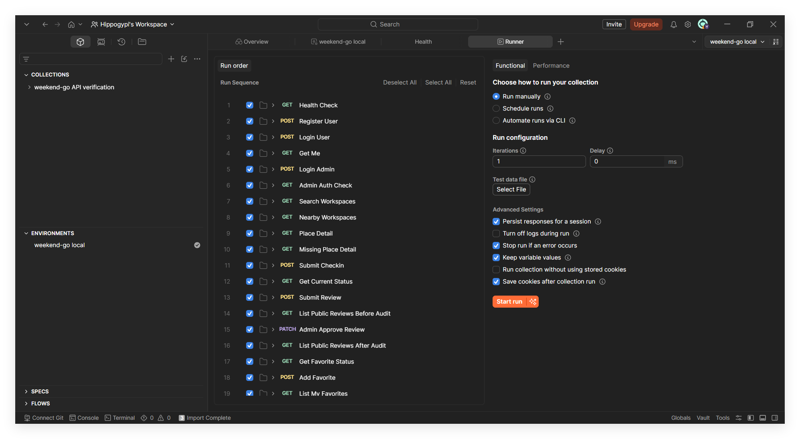
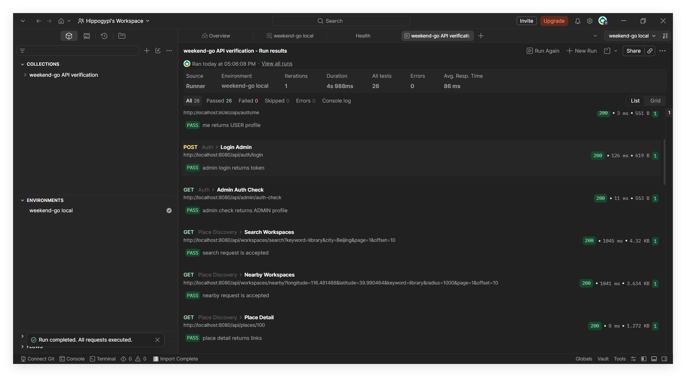

# 《服务开发技术》课程实验报告

| 项目 | 内容 |
|------|------|
| 实验项目名称 | 城市学习办公空间共建平台 |
| 项目代号 | weekend-go |
| 课程名称 | 服务开发技术 |
| 技术栈 | Spring Boot + Vue + MySQL |
| 外部服务 | 高德地图 Web 服务 API / 高德地图 JS API |
| 文档版本 | V1.3 |
| 编写日期 | 2026-06-05 |
| 小组成员 |  |

> 说明：本文档依据课程实验要求和项目实现编写，页面截图位于 `docs/screenshot/`。

---

## 1. 实验目的与要求

### 1.1 实验目的

本实验旨在围绕一个自选服务场景完成服务开发全过程，重点训练以下能力：

- 分析真实或模拟业务场景，识别需要对外提供的数据资源和服务资源。
- 规划数据资源，设计资源之间的关系和资源访问路径。
- 按 RESTful 风格设计资源 URI、HTTP 方法、资源表述和服务反馈。
- 完成后端资源服务实现，并能够通过 Postman 等工具访问。
- 完成一种客户端访问方式，使用户能够通过界面调用服务接口。
- 结合数据库、外部 API、权限控制和错误处理，形成可运行、可验证的服务开发闭环。

本项目选择“城市学习办公空间共建平台”作为实验场景，围绕学习、阅读、远程办公和临时办公人群对空间信息的需求，设计并实现一组面向地点发现、用户共建和内容审核的资源服务。

### 1.2 课程实验要求

根据课程实验说明，实验内容主要分为“服务场景及设计”和“开发服务”两部分。服务场景及设计阶段需要完成服务场景设计、服务资源搜集与整理、数据资源规划、资源 URI 设计、资源表述设计、资源接口设计、资源之间的链接规划以及资源服务反馈设计。开发服务阶段需要完成资源服务实现、数据库设计或数据存储方案、Postman 访问验证、一种客户端访问方式，以及接口设计与验证材料。

课程评分强调服务场景创意和设计、开发实现两方面。本报告按照课程实验的资源服务设计逻辑组织内容，先说明服务场景和资源规划，再说明 RESTful 接口、系统实现、客户端访问和测试验证。

### 1.3 本项目完成范围

weekend-go 完成以下实验范围：

- 完成城市学习办公空间服务场景设计。
- 使用高德地图 API 搜集地点基础资源，并结合本地用户共建数据形成地点资源。
- 设计 MySQL 数据表保存用户、地点、评价、图片、打卡、收藏、问答和审核等资源。
- 提供 RESTful API，支持认证、地点发现、地点详情、打卡、评价、图片上传、收藏、问答和管理员审核。
- 提供 Vue 客户端作为服务访问端。
- 提供 Postman Collection、后端测试、前端测试、前端构建和本地 smoke 验证记录。

---

## 2. 项目服务场景与需求分析

### 2.1 项目背景

用户在学习、备考、阅读、远程办公和临时办公时，经常需要寻找附近适合长时间停留的空间。普通地图服务可以提供地点名称、地址、距离和基础分类，但难以回答学习办公场景中的具体问题：

- 这里是否安静？
- Wi-Fi 是否稳定？
- 插座是否充足？
- 是否适合久坐？
- 当前是否拥挤？
- 有没有近期真实用户反馈？

因此，本项目将“城市学习办公空间”作为垂直服务场景，在高德地图 POI 数据的基础上，引入用户评价、地点照片、打卡反馈和管理员审核机制，形成面向学习、阅读和办公人群的资源服务。

### 2.2 服务目标

本项目目标是围绕学习办公空间建立一组可访问、可组合、可验证的 RESTful 资源服务：

- 使用高德地图 Web 服务 API 获取候选地点。
- 将外部 POI 与本地共建数据合并为地点资源。
- 在附近模式中以浏览器定位坐标作为地图中心点，即使暂无地点结果也保留地图基础视图。
- 支持用户登录后打卡、评价、上传照片、收藏、提问和回答。
- 支持管理员审核评价和图片，保证公开数据基本可信。
- 提供 Vue 客户端作为服务消费端，并通过 Postman、自动化测试和本地 smoke 验证接口。

### 2.3 用户角色

| 角色 | 主要目标 | 典型操作 |
|------|----------|----------|
| 普通用户 | 找到适合学习办公的地点 | 搜索地点、查看详情、打卡、写评价/上传照片、收藏、提问/回答 |
| 管理员 | 维护共建内容质量 | 查看待审核评价/图片、通过或驳回内容 |

### 2.4 业务流程

项目核心业务流程如下：

```text
用户登录
  -> 搜索或查看附近地点
  -> 系统合并高德 POI 与本地数据
  -> 用户进入地点详情页
  -> 用户打卡或写评价 / 上传照片
  -> 管理员审核评价和图片
  -> 审核通过内容进入公开展示和长期画像聚合
  -> 其他用户基于更新后的数据选择地点
```


---

## 3. 服务资源分析与数据规划

### 3.1 外部资源

项目使用高德地图 Web 服务 API 获取地点基础信息，包括地点名称、地址、经纬度、POI 类型和周边搜索结果；前端使用高德地图 JS API 展示地图、中心点和 marker。高德 POI 负责提供“地点在哪里”的基础事实，本地服务负责补充“是否适合学习办公”的场景化信息。

```text
高德 POI
  -> places 基础地点
  -> reviews / place_images / checkins / place_qa / favorites
  -> 地点详情资源表述
```

### 3.2 本地服务资源

| 资源 | 服务含义 | 实现内容 |
|------|----------|----------|
| 用户资源 | 系统账号、角色、昵称 | 注册、登录、当前用户、昵称修改 |
| 地点资源 | 学习办公空间候选地点 | 高德 POI 入库、本地详情、地图 marker |
| 打卡资源 | 到访记录和可选实时状态反馈 | 拥挤度、噪音、是否有座、备注 |
| 评价资源 | 长期体验和主要共建入口 | 多维评分、文字评价、客观属性、图片绑定 |
| 图片资源 | 地点照片 | 随评价提交或独立图片接口，进入审核 |
| 收藏资源 | 用户收藏地点 | 收藏、取消收藏、我的收藏 |
| 问答资源 | 地点相关提问与回答 | 问大家 tab |
| 审核资源 | 管理员处理待审核内容 | 待审核列表、统计、通过/驳回 |

### 3.3 数据资源规划

项目使用 MySQL 存储本地资源，核心表如下：

| 表 | 作用 |
|----|------|
| `users` | 用户账号、密码哈希、角色、昵称 |
| `places` | 地点基础信息、高德 POI 标识、位置与状态 |
| `workspace_profiles` | 地点长期画像聚合结果 |
| `checkins` | 用户打卡和实时状态反馈 |
| `reviews` | 评价、评分、客观属性、审核状态 |
| `place_images` | 地点图片，可绑定评价 |
| `favorites` | 用户收藏地点 |
| `place_qa` | 问大家的问题与回答 |
| `review_likes` | 评价点赞关系 |
| `review_replies` | 评价回复 |
| `audit_logs` | 管理员审核日志 |

核心资源关系如下：

```text
users 1 -- N reviews
users 1 -- N checkins
users 1 -- N favorites
users 1 -- N place_qa

places 1 -- N reviews
places 1 -- N checkins
places 1 -- N place_images
places 1 -- N place_qa

reviews 1 -- N place_images
reviews 1 -- N review_likes
reviews 1 -- N review_replies
places 1 -- 1 workspace_profiles
```

### 3.4 共建数据口径

项目围绕学习办公空间的数据可信度和可展示性，采用以下共建数据口径：

- 打卡表示到访记录和可选实时状态反馈，不作为主要共建入口。
- 写评价 / 上传照片是主要共建入口，评价、评分、地点图、客观属性都从这里进入。
- 长期画像主要由审核通过的评价数据聚合。
- 实时状态可由最近打卡反馈聚合。
- 打卡仅用于到访记录和实时状态反馈，图片与长期属性共建统一由评价流程承载。

---

## 4. RESTful 资源服务设计

### 4.1 URI 设计原则

项目接口遵循资源导向原则：

- URI 使用名词描述资源。
- HTTP 方法表达查询、创建、更新和删除等操作。
- JSON 作为统一资源表述格式。
- 写操作需要登录，管理员接口需要 ADMIN 角色。
- 统一响应结构便于前端和 Postman 验证。

### 4.2 核心服务接口

| 资源类别 | 方法 | URI | 说明 | 权限 |
|----------|------|-----|------|------|
| 健康检查 | GET | `/api/health` | 后端服务状态 | 公开 |
| 用户认证 | POST | `/api/auth/register` | 用户注册 | 公开 |
| 用户认证 | POST | `/api/auth/login` | 用户登录 | 公开 |
| 用户认证 | GET | `/api/auth/me` | 当前用户信息 | 登录 |
| 地点发现 | GET | `/api/workspaces/search` | 关键词搜索地点 | 公开接口，前端登录后访问页面 |
| 地点发现 | GET | `/api/workspaces/nearby` | 附近地点搜索 | 公开接口，前端登录后访问页面 |
| 地图标记 | GET | `/api/map/markers` | 周边已标记地点和收藏地点 | 公开接口，可识别登录用户 |
| 地点详情 | GET | `/api/places/{placeId}` | 地点基础信息和长期画像 | 公开接口，前端登录后访问页面 |
| 打卡 | POST | `/api/places/{placeId}/checkins` | 提交打卡 | 登录 |
| 打卡 | GET | `/api/places/{placeId}/current-status` | 当前实时状态 | 公开 |
| 评价 | POST | `/api/places/{placeId}/reviews` | 写评价/上传照片/补充属性 | 登录 |
| 评价 | GET | `/api/places/{placeId}/reviews` | 公开评价列表 | 公开 |
| 评价互动 | POST | `/api/reviews/{reviewId}/likes` | 点赞评价 | 登录 |
| 评价互动 | POST | `/api/reviews/{reviewId}/replies` | 回复评价 | 登录 |
| 文件上传 | POST | `/api/upload` | 上传图片文件并返回访问路径 | 登录 |
| 收藏 | POST | `/api/places/{placeId}/favorite` | 收藏地点 | 登录 |
| 问答 | POST | `/api/places/{placeId}/questions` | 提问 | 登录 |
| 问答 | POST | `/api/questions/{questionId}/answers` | 回答问题 | 登录 |
| 管理员 | GET | `/api/admin/audits/pending-list` | 待审核列表 | ADMIN |
| 管理员 | PATCH | `/api/admin/reviews/{reviewId}/audit` | 审核评价 | ADMIN |
| 管理员 | PATCH | `/api/admin/images/{imageId}/audit` | 审核图片 | ADMIN |

### 4.3 资源表述

统一成功响应结构：

```json
{
  "success": true,
  "code": "OK",
  "message": "success",
  "data": {}
}
```

统一错误响应结构：

```json
{
  "success": false,
  "code": "PLACE_NOT_FOUND",
  "message": "地点不存在或已被删除",
  "data": null
}
```

地点详情资源示例：

```json
{
  "id": 1,
  "name": "周末图书馆自习区",
  "address": "上海市徐汇区衡山路 100 号",
  "longitude": 121.446601,
  "latitude": 31.20421,
  "workspaceStatus": "APPROVED",
  "workspaceProfile": {
    "quietScore": 4.5,
    "wifiScore": 4.0,
    "socketScore": 4.0,
    "seatScore": 4.5,
    "score": 4.3,
    "trustLevel": "LOW"
  }
}
```

前端会将 `APPROVED`、`LOW` 等系统枚举翻译成“已收录”“资料较少”等用户可见文案，避免直接向用户暴露后端枚举值。

### 4.4 资源链接

客户端以地点详情页承接主要资源操作。用户从地点列表进入详情后，可以查看当前状态、公开评价和问大家内容，也可以继续进行打卡、写评价 / 上传照片和收藏。管理员通过审核工作台集中处理待审核评价和图片。

图 4-1 为客户端资源访问关系示意：

```text
地点列表
  -> 地点详情
     -> 当前状态
     -> 公开评价
     -> 问大家
     -> 打卡
     -> 写评价 / 上传照片
     -> 收藏

管理员导航
  -> 审核工作台
     -> 待审核评价
     -> 待审核图片
     -> 通过或驳回
```


### 4.5 服务反馈

| 场景 | HTTP 状态 | 前端/服务反馈 |
|------|-----------|---------------|
| 未登录访问写操作 | 401 | 登录已过期或需要登录 |
| 普通用户访问管理员接口 | 403 | 无管理员权限 |
| 地点/评价/图片不存在 | 404 | 资源不存在或已被删除 |
| 参数错误 | 400 | 请求参数错误 |
| 外部高德服务异常 | 502 | 外部位置服务暂时不可用 |
| 系统异常 | 500 | 系统异常，请稍后重试 |

---

## 5. 服务实现与系统架构

### 5.1 总体技术架构

| 层级 | 技术 | 说明 |
|------|------|------|
| 后端框架 | Spring Boot | 提供 RESTful 服务 |
| 安全认证 | Spring Security + 自定义 Bearer Token | 区分 USER 与 ADMIN |
| 数据访问 | Spring JDBC | 使用 `JdbcTemplate` 访问 MySQL |
| 数据库 | MySQL | 保存用户、地点、评价、图片、问答、审核等资源 |
| 前端框架 | Vue | 实现客户端访问与页面展示 |
| 路由与构建 | Vue Router + Vite | 前端路由、开发服务和生产构建 |
| 外部服务 | 高德地图 Web 服务 API / JS API | 获取 POI 与展示地图 |

### 5.2 后端分层结构

后端采用 Spring Boot，按业务域拆分 Controller、Service、Repository：

```text
Controller: 接收 HTTP 请求，返回 ApiResponse
Service: 处理业务规则和资源状态转换
Repository: 访问 MySQL 或内存实现
```

关键代码位置：

- `backend/src/main/java/com/weekendgo/auth/security/SecurityConfig.java`
- `backend/src/main/java/com/weekendgo/place/PlaceDiscoveryController.java`
- `backend/src/main/java/com/weekendgo/checkin/CheckinService.java`
- `backend/src/main/java/com/weekendgo/interaction/InteractionController.java`
- `backend/src/main/java/com/weekendgo/admin/AdminController.java`
- `backend/src/main/java/com/weekendgo/upload/UploadController.java`

### 5.3 认证与权限控制

系统使用 Spring Security + 自定义 Bearer Token。普通用户登录后才能执行打卡、评价、收藏、问答等写操作；管理员接口要求 `ROLE_ADMIN`。

关键权限规则：

```java
.requestMatchers("/api/admin/**").hasRole("ADMIN")
.anyRequest().authenticated()
```

### 5.4 主要服务实现

地点发现服务负责调用高德地图 Web 服务 API，将外部 POI 转换为本地地点资源，并按 `amapPoiId` 去重入库。关键词搜索用于发现新地点，附近模式用于展示周边已有内容或收藏点。

打卡资源用于记录用户到访，也可补充当前人流、噪音和座位情况。后端根据最近时间窗口内的打卡记录计算当前状态；无近期反馈时返回“暂无近期反馈”语义，避免误导用户。

评价是项目的主要共建载体。用户写评价时可以提交多维评分、文字评价、座位评分、最低消费、是否适合久坐、适合场景和地点照片。写评价页先通过 multipart 上传图片文件，后端保存到本地 `uploads/` 目录并返回 `/uploads/...` 路径；前端再把图片路径和描述随评价提交。审核通过后的评价和图片进入公开展示，评价评分参与长期画像聚合。

### 5.5 前端客户端实现

前端使用 Vue + Vue Router + Vite，通过统一 API client 调用后端服务。核心 API 封装集中在 `frontend/src/services/weekendGoApi.ts`，底层请求由 `frontend/src/services/apiClient.ts` 统一处理 base URL、Bearer Token 注入、响应解包和错误抛出。

前端服务封装示例：

```ts
submitCheckin(placeId, body)
submitReview(placeId, body)
uploadFile(file)
pendingList(type, page, size)
auditReview(reviewId, body)
```

---

## 6. 客户端访问、测试验证与运行结果

### 6.1 本地运行环境

| 组件 | 地址/说明 |
|------|-----------|
| MySQL | 本地 `weekend_go` 数据库 |
| 后端 | `http://127.0.0.1:8080` |
| 前端 | `http://127.0.0.1:5174` 或 Vite 实际端口 |
| 演示普通用户 | `api-user-demo / secret123` |
| 演示管理员 | `api-admin-demo / secret123` |

### 6.2 客户端功能展示

登录页提供普通用户登录和注册入口。用户登录成功后，前端保存 Bearer Token，并通过路由守卫控制核心页面访问。


地点发现首页支持附近模式和关键词搜索。附近模式会请求浏览器定位，并以定位坐标作为地图中心点；系统调用地图 marker 服务展示周边已标记地点和用户收藏地点。


地点详情页包含概况、评价、问大家和去贡献四个 tab。用户可查看地点基础信息、长期画像、当前状态、公开评价、图片、问题与回答，也可以进入打卡或写评价流程。


打卡页用于记录用户到访，并可选填写拥挤度、噪音和座位情况。


写评价 / 上传照片页是主要共建入口。用户可填写评分、文字评价、客观属性，并上传多张图片。


个人中心展示用户账号信息、昵称、我的收藏、我的打卡和我的评价。


管理员审核工作台展示待审核评价、待审核图片和今日处理统计。管理员可以对评价和图片执行通过或驳回操作。


### 6.3 页面与服务调用对应关系

| 页面 | 主要服务调用 |
|------|--------------|
| 登录页 | `POST /api/auth/login`、`POST /api/auth/register` |
| 地点发现页 | `GET /api/map/markers`、`GET /api/workspaces/search` |
| 地点详情页 | `GET /api/places/{id}`、`GET /api/places/{id}/reviews`、`GET /api/places/{id}/current-status` |
| 打卡页 | `POST /api/places/{id}/checkins` |
| 写评价 / 上传照片页 | `POST /api/upload`、`POST /api/places/{id}/reviews` |
| 个人中心 | `GET /api/me/favorites`、`GET /api/me/checkins`、`GET /api/me/reviews` |
| 管理员审核 | `GET /api/admin/audits/pending-list`、`PATCH /api/admin/reviews/{id}/audit`、`PATCH /api/admin/images/{id}/audit` |

### 6.4 验证方式

项目通过多种方式验证服务可用性：

- 后端单元测试：覆盖认证、地点、打卡、评价、问答、审核等业务域。
- 前端单元测试：覆盖 API client、路由守卫、session、错误处理和 display label。
- 前端构建：验证 TypeScript 类型和生产构建。
- Postman Collection：覆盖主要 REST API 调用链路。
- 本地端到端 smoke：启动 MySQL、Spring Boot 后端和 Vue 前端，用演示账号走关键页面。

### 6.5 最近验证结果

| 检查项 | 结果 |
|--------|------|
| `python -m json.tool feature_list.json` | 通过 |
| `frontend npm run test` | 56 tests / 9 files 通过 |
| `frontend npm run build` | 通过 |
| `backend .\mvnw.cmd test` | 77 tests 通过 |
| 浏览器 smoke | 普通用户首页地图、详情、贡献入口、打卡、写评价、个人中心通过；管理员审核工作台通过 |
| 浏览器流程 API 状态 | 未出现 4xx/5xx |

### 6.6 Postman 与本地运行结果

项目提供 `docs/api/weekend-go.postman_collection.json`，用于验证主要 REST API 调用链路。Collection 覆盖健康检查、认证、地点搜索、地点详情、打卡、评价、图片、收藏、管理员审核和常见错误反馈等接口。Postman 验证体现了课程要求中“所开发的服务需能够通过 Postman 访问成功”的交付重点。

本次在 Postman 桌面客户端中导入 `weekend-go API verification` Collection，并选择 `weekend-go local` 环境执行验证。后端地址为 `http://localhost:8080`。Collection 共执行 30 个接口请求，其中设置 26 个 Postman 测试断言；运行结果为 26 个断言全部通过，失败数为 0，错误数为 0。运行结果如下：

| 验证范围 | 请求数 | 结果 |
|----------|--------|------|
| 健康检查 | 1 | 通过 |
| 用户认证与管理员鉴权 | 5 | 通过 |
| 地点搜索、详情与不存在地点 | 4 | 通过 |
| 打卡与当前状态 | 2 | 通过 |
| 评价提交、审核与公开列表 | 4 | 通过 |
| 收藏状态、收藏、列表与取消收藏 | 4 | 通过 |
| 图片提交、审核与公开列表 | 4 | 通过 |
| 401、403、404 错误反馈 | 6 | 通过 |
| 合计 | 30 | 26 个 Postman 断言通过，0 失败，0 错误 |

图 6-1 为 Postman Runner 运行前配置截图，所有请求均被选中，运行环境为 `weekend-go local`：



图 6-2 为 Postman Collection 运行结果截图，结果显示 `All tests 26`、`Passed 26`、`Failed 0`、`Errors 0`：



在本地 MySQL、Spring Boot 后端和 Vue 前端同时运行时，系统能够完成以下主要流程：

```text
普通用户登录
  -> 地点发现首页加载地图与 marker
  -> 进入地点详情
  -> 查看当前状态、评价和问大家
  -> 提交打卡
  -> 写评价 / 上传照片
  -> 在个人中心查看收藏、打卡和评价

管理员登录
  -> 进入审核工作台
  -> 查看待审核评价和图片
  -> 执行通过或驳回
```

---

## 7. 项目总结

weekend-go 围绕“城市学习办公空间”这一具体服务场景，完成了从服务场景设计、服务资源搜集与整理、数据资源规划、RESTful URI 设计、资源表述、资源链接、服务反馈、后端实现到 Vue 客户端访问的完整服务开发闭环。

在服务场景方面，项目把学习办公空间作为垂直场景，通过安静度、Wi-Fi、插座、座位、最低消费、适合久坐和适合场景等信息描述地点是否适合学习办公。在资源设计方面，项目将外部高德 POI 与本地用户共建数据结合，规划了用户、地点、打卡、评价、图片、收藏、问答和审核等资源，并通过 MySQL 表结构保存这些资源及其关系。

在服务接口方面，项目使用 Spring Boot 提供 RESTful API，通过 `/api/workspaces/search`、`/api/places/{placeId}`、`/api/places/{placeId}/reviews`、`/api/admin/audits/pending-list` 等 URI 表达资源，通过 GET、POST、PATCH、DELETE 等 HTTP 方法表达资源操作，通过统一 JSON 响应表述资源状态。服务还针对未登录、无管理员权限、资源不存在、参数错误、外部地图服务异常和系统异常提供明确反馈。

在服务实现方面，后端采用 Controller、Service、Repository 分层，结合 Spring Security、自定义 Bearer Token、Spring JDBC 和 MySQL 完成认证、地点发现、打卡、评价、图片、问答、收藏和审核功能；前端采用 Vue 客户端消费这些服务，形成可演示的页面闭环；Postman Collection、自动化测试、前端构建和本地浏览器 smoke 共同验证服务可访问、可运行、可展示。

### 小组成员贡献与权重

| 成员 | 主要贡献 | 权重 |
|------|----------|------|
|  |  |  |
|  |  |  |
|  |  |  |
|  |  |  |
