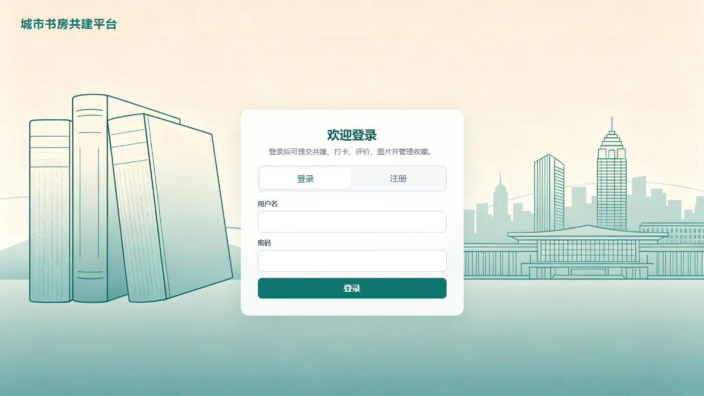
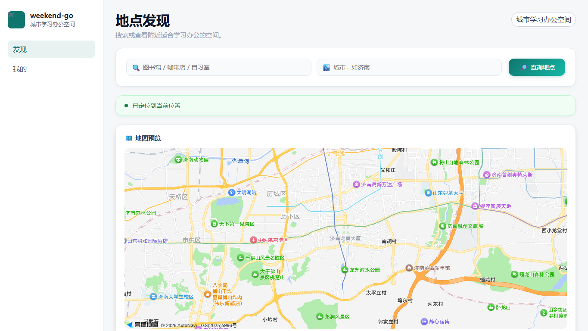
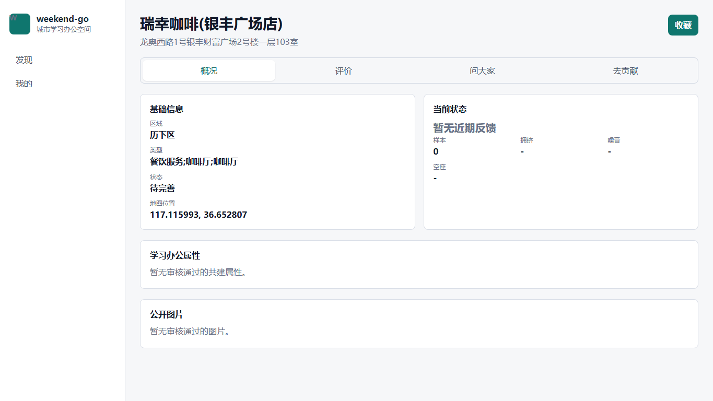
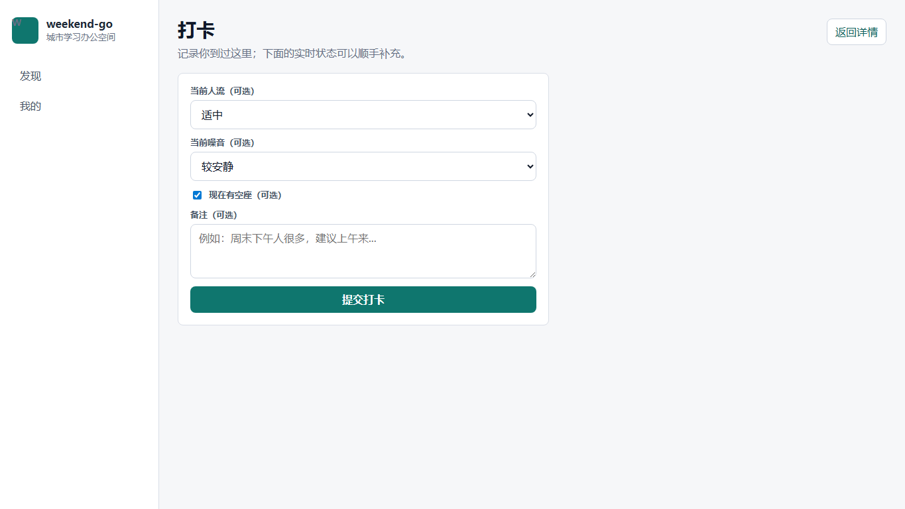
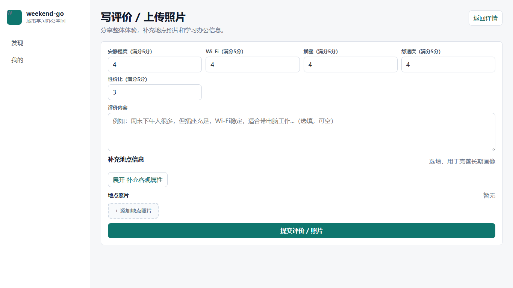
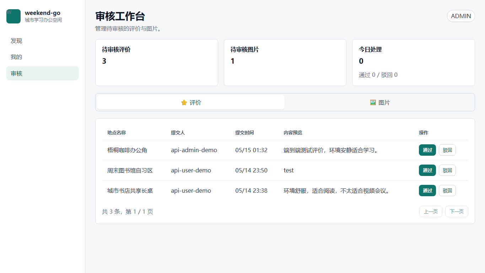

# 城市学习办公空间共建平台

# 软件需求说明书 V2.0

> 项目代号：weekend-go  
> 技术栈：Spring Boot + Vue + MySQL  
> 外部位置服务：高德地图 Web 服务 API  
> 文档日期：2026-06-05  
> 说明：本文档基于当前项目实现更新，不修改第一版原始需求文档。第一版文档仍保留在 `docs/城市学习办公空间共建平台_软件需求说明书.docx`。

---

## 1. 引言

### 1.1 编写目的

本文档用于描述 weekend-go 当前版本的业务边界、服务资源、数据模型、接口范围、页面结构和实现约束。与第一版说明书相比，V2.0 更贴近当前实际实现，可作为后续开发、课程报告、演示 PPT 和接口说明的主要依据。

### 1.2 项目背景

用户在学习、阅读、备考、远程办公和临时办公时，需要找到适合长时间停留的城市空间。普通地图服务可以回答“地点在哪里”，但难以回答“是否安静”“是否有插座”“Wi-Fi 是否稳定”“是否适合久坐”“当前是否拥挤”等学习办公场景问题。

weekend-go 以高德地图 POI 为基础地点来源，通过用户评价、地点照片、打卡和管理员审核沉淀学习办公场景数据，形成面向城市学习办公空间的垂直资源服务。

### 1.3 V2.0 相对第一版的主要变化

| 主题 | 第一版描述 | 当前 V2.0 口径 |
|------|------------|----------------|
| 属性共建 | 独立的 workspace-profile-submissions 提交流程 | 已并入写评价 / 上传照片流程，由 reviews 承载 |
| 共建入口 | 属性共建、打卡、评价、图片较分散 | 前端保留两个主入口：打卡、写评价 / 上传照片 |
| 打卡 | 实时状态反馈 | 到访记录 / 可选实时状态反馈，不作为主要共建入口 |
| 图片 | 可独立上传并审核 | 当前主要随评价提交并进入图片审核；独立图片接口保留兼容 |
| 审核 | 属性共建、评价、图片分别审核 | 管理员工作台按评价和图片审核 |
| 访问策略 | 原规格书包含未登录访问者状态 | 当前前端强制登录后访问核心页面 |
| 问答与互动 | 第一版未作为核心重点 | 当前已实现问大家、评价点赞和回复 |

### 1.4 术语定义

| 术语 | 定义 |
|------|------|
| 地点 | 高德 POI 与本地数据合并后的学习办公候选空间 |
| 长期画像 | 由审核通过的评价、评分、照片和客观属性聚合而成的地点特征 |
| 打卡 | 用户记录到访，也可顺手反馈当前人流、噪音和座位状态 |
| 写评价 / 上传照片 | 当前主要共建入口，包含评分、文字、照片和客观属性 |
| 审核 | 管理员对待公开的评价和图片执行通过或驳回 |
| 问大家 | 围绕地点的用户提问和回答 |

---

## 2. 项目总体说明

### 2.1 项目目标

1. 帮助用户发现附近适合学习、阅读和办公的空间。
2. 通过评价/上传照片沉淀地点长期画像。
3. 通过打卡反馈补充实时状态。
4. 通过管理员审核保证公开内容基本可信。
5. 提供可通过 REST API、Postman 和 Vue 客户端访问的服务。

### 2.2 项目边界

当前版本包含：

- 用户注册、登录、退出、当前用户、昵称修改。
- 地点关键词搜索、附近地点、地图 marker、地点详情。
- 打卡与当前状态查询。
- 写评价、上传照片、补充客观属性。
- 收藏、评价点赞、评价回复。
- 问大家。
- 个人中心。
- 管理员审核工作台。

当前版本不包含：

- 路线规划和预计到达时间。
- 商家入驻、预约座位、支付。
- 社交关系、私信和组队学习。
- 图片内容自动识别。
- 打卡上传图片。
- 复杂推荐算法和机器学习排序。

### 2.3 用户角色

| 角色 | 权限 |
|------|------|
| USER | 登录后可搜索地点、查看详情、打卡、写评价/上传照片、收藏、提问、回答、点赞、回复 |
| ADMIN | 具备 USER 能力，并可访问审核工作台、审核评价和图片 |

当前前端核心页面要求用户先登录；后端仍保留部分公开查询接口，便于接口验证和服务复用。

### 2.4 总体业务闭环

```text
用户登录
  -> 搜索或查看附近地点
  -> 进入地点详情
  -> 打卡或写评价 / 上传照片
  -> 管理员审核评价和图片
  -> 审核通过内容进入公开展示
  -> 地点长期画像和实时状态更新
```

---

## 3. 功能需求

### 3.1 用户账号

#### 功能说明

用户可注册、登录、退出，并在个人中心查看和修改昵称。

#### 主要需求

- 注册时创建普通 USER 账号。
- 密码必须加密存储。
- 登录成功后返回访问 token。
- 前端将 token 保存在本地会话状态中。
- 用户访问受保护页面时，未登录应跳转登录页。
- 管理员账号通过数据库 seed 或后台配置准备，前端不提供创建管理员入口。

### 3.2 地点发现

#### 功能说明

用户可通过关键词搜索或附近模式发现地点。系统从高德地图获取基础 POI，并结合本地共建数据展示。

#### 主要需求

- 支持关键词搜索地点。
- 支持附近地点 marker 查询。
- 附近模式定位成功后，地图应以用户当前位置为中心点。
- 搜索/附近查询完成后，即使暂无地点结果，也应展示地图基础视图，避免页面主体空白。
- 支持地点去重入库。
- 地点列表展示名称、地址、区域、状态和评分。
- 定位失败时，前端提示用户可切换到关键词搜索。
- 前端不得向用户展示 `CANDIDATE`、`APPROVED` 等系统枚举，应翻译为自然中文。

### 3.3 地点详情

#### 功能说明

地点详情页是核心资源展示页，包含概况、评价、问大家和去贡献四个 tab。

#### 主要需求

- 概况展示地点基础信息、当前状态、学习办公属性和公开图片。
- 评价展示审核通过的公开评价，支持最新/最热排序、点赞、回复。
- 问大家展示地点问题和回答，支持提问和回答。
- 去贡献提供打卡和写评价/上传照片两个入口。
- 系统状态枚举必须转换为用户可理解的中文。

### 3.4 打卡

#### 功能说明

打卡用于记录用户到过某地点，也可顺手反馈当前人流、噪音和座位状态。

#### 主要需求

- 登录用户可提交打卡。
- 打卡字段包括拥挤度、噪音、是否有空座和备注。
- 打卡不是主要共建入口。
- 打卡当前不支持上传图片。
- 后端根据最近时间窗口内打卡记录计算当前状态。
- 无近期打卡时展示“暂无近期反馈”。

### 3.5 写评价 / 上传照片

#### 功能说明

写评价 / 上传照片是当前版本主要共建入口，用于沉淀地点长期画像。

#### 主要需求

- 登录用户可提交评价。
- 评价可包含安静程度、Wi-Fi、插座、舒适度、性价比等评分。
- 评价内容可选，允许纯评分/属性型评价。
- 可补充座位评分、最低消费、是否适合久坐、适合场景等客观属性。
- 可添加多张地点照片。前端先上传本地图片文件并获得 `/uploads/...` 访问路径，再将图片路径和描述随评价提交。
- 新提交评价和照片默认进入审核流程。
- 审核通过后，评价和图片才公开展示。
- 审核通过的评价参与地点长期画像聚合。

### 3.6 收藏

#### 功能说明

用户可收藏感兴趣的地点，并在个人中心查看收藏列表。

#### 主要需求

- 登录用户可收藏或取消收藏地点。
- 地点详情页显示当前收藏状态。
- 个人中心展示收藏地点并可跳转详情。

### 3.7 问大家

#### 功能说明

问大家用于围绕地点进行轻量问答。

#### 主要需求

- 登录用户可在地点详情页提问。
- 登录用户可回答已有问题。
- 问题展示回答数量。
- 点击问题可展开回答列表。

### 3.8 评价互动

#### 功能说明

评价互动用于提升评价信息的可用性。

#### 主要需求

- 支持评价点赞和取消点赞。
- 支持评价回复。
- 评价列表可按最新或最热排序。

### 3.9 个人中心

#### 功能说明

个人中心用于查看用户账号信息和个人贡献记录。

#### 主要需求

- 展示用户名、昵称和角色。
- 支持修改昵称。
- 展示我的收藏、我的打卡、我的评价。
- 我的评价展示审核状态、评分、客观属性、适合场景和图片。
- 打卡和评价中的系统枚举必须翻译为自然中文。

### 3.10 管理员审核工作台

#### 功能说明

管理员审核工作台用于处理待公开的评价和图片。

#### 主要需求

- 仅 ADMIN 可访问。
- 展示待审核评价数量、待审核图片数量和今日处理统计。
- 支持按评价/图片切换待审核列表。
- 支持通过和驳回。
- 审核操作写入审核日志。

---

## 4. 数据资源设计

### 4.1 核心资源列表

| 资源 | 数据表 | 说明 |
|------|--------|------|
| 用户 | `users` | 账号、密码哈希、角色、昵称 |
| 地点 | `places` | 高德 POI 与本地地点基础信息 |
| 长期画像 | `workspace_profiles` | 审核通过评价聚合结果 |
| 打卡 | `checkins` | 到访记录和实时状态反馈 |
| 评价 | `reviews` | 评分、文字、客观属性、审核状态 |
| 图片 | `place_images` | 地点图片，支持绑定评价 |
| 收藏 | `favorites` | 用户收藏地点 |
| 问答 | `place_qa` | 问题与回答 |
| 点赞 | `review_likes` | 用户对评价的点赞 |
| 回复 | `review_replies` | 评价回复 |
| 审核日志 | `audit_logs` | 管理员审核记录 |

### 4.2 关键资源关系

```text
users 1 -- N checkins
users 1 -- N reviews
users 1 -- N favorites
users 1 -- N place_qa
places 1 -- N checkins
places 1 -- N reviews
places 1 -- N place_images
places 1 -- N place_qa
reviews 1 -- N place_images
reviews 1 -- N review_likes
reviews 1 -- N review_replies
admins 1 -- N audit_logs
```

### 4.3 状态枚举

| 枚举 | 值 | 前端展示 |
|------|----|----------|
| `workspace_status` | `CANDIDATE`, `PENDING`, `APPROVED`, `REJECTED` | 待完善、待审核、已收录、未收录 |
| `audit_status` | `PENDING`, `APPROVED`, `REJECTED`, `DELETED` | 审核中、已通过、已拒绝、已删除 |
| `trust_level` | `LOW`, `MEDIUM`, `HIGH` | 资料较少、资料适中、资料充分 |
| `crowd_level` | `FREE`, `NORMAL`, `CROWDED`, `FULL` | 空闲、适中、较拥挤、爆满 |
| `noise_level` | `QUIET`, `RELATIVELY_QUIET`, `NORMAL`, `NOISY`, `VERY_NOISY` | 安静、较安静、一般、较吵、很吵 |

---

## 5. REST 接口范围

### 5.1 认证接口

| 方法 | URI | 说明 |
|------|-----|------|
| POST | `/api/auth/register` | 注册 |
| POST | `/api/auth/login` | 登录 |
| POST | `/api/auth/logout` | 退出 |
| GET | `/api/auth/me` | 当前用户 |
| PATCH | `/api/auth/me` | 修改昵称 |

### 5.2 地点接口

| 方法 | URI | 说明 |
|------|-----|------|
| GET | `/api/workspaces/search` | 关键词搜索 |
| GET | `/api/workspaces/nearby` | 附近搜索 |
| GET | `/api/places/{placeId}` | 地点详情 |
| GET | `/api/map/markers` | 地图 marker |
| GET | `/api/places/{placeId}/workspace-profile` | 地点长期画像 |

### 5.3 打卡接口

| 方法 | URI | 说明 |
|------|-----|------|
| POST | `/api/places/{placeId}/checkins` | 提交打卡 |
| GET | `/api/places/{placeId}/current-status` | 当前状态 |
| GET | `/api/me/checkins` | 我的打卡 |

### 5.4 评价、图片与互动接口

| 方法 | URI | 说明 |
|------|-----|------|
| POST | `/api/places/{placeId}/reviews` | 提交评价/照片/客观属性 |
| GET | `/api/places/{placeId}/reviews` | 公开评价 |
| GET | `/api/me/reviews` | 我的评价 |
| POST | `/api/reviews/{reviewId}/likes` | 点赞 |
| DELETE | `/api/reviews/{reviewId}/likes` | 取消点赞 |
| GET | `/api/reviews/{reviewId}/replies` | 评价回复 |
| POST | `/api/reviews/{reviewId}/replies` | 提交回复 |
| GET | `/api/places/{placeId}/images` | 公开图片 |
| POST | `/api/places/{placeId}/images` | 独立图片提交，保留兼容 |
| POST | `/api/upload` | 上传图片文件，返回 `/uploads/{filename}` |

### 5.5 收藏接口

| 方法 | URI | 说明 |
|------|-----|------|
| GET | `/api/places/{placeId}/favorite` | 收藏状态 |
| POST | `/api/places/{placeId}/favorite` | 收藏 |
| DELETE | `/api/places/{placeId}/favorite` | 取消收藏 |
| GET | `/api/me/favorites` | 我的收藏 |

### 5.6 问答接口

| 方法 | URI | 说明 |
|------|-----|------|
| GET | `/api/places/{placeId}/questions` | 问题列表 |
| POST | `/api/places/{placeId}/questions` | 提问 |
| GET | `/api/questions/{questionId}/answers` | 回答列表 |
| POST | `/api/questions/{questionId}/answers` | 回答 |

### 5.7 管理员接口

| 方法 | URI | 说明 |
|------|-----|------|
| GET | `/api/admin/auth-check` | 管理员身份检查 |
| GET | `/api/admin/audits/pending-list` | 待审核列表 |
| GET | `/api/admin/audits/stats` | 审核统计 |
| PATCH | `/api/admin/reviews/{reviewId}/audit` | 审核评价 |
| PATCH | `/api/admin/images/{imageId}/audit` | 审核图片 |

---

## 6. 资源表述与错误反馈

### 6.1 统一响应格式

成功响应：

```json
{
  "success": true,
  "code": "OK",
  "message": "success",
  "data": {}
}
```

错误响应：

```json
{
  "success": false,
  "code": "PLACE_NOT_FOUND",
  "message": "地点不存在或已被删除",
  "data": null
}
```

### 6.2 权限反馈

| 场景 | 状态码 | 说明 |
|------|--------|------|
| 未登录访问需登录接口 | 401 | 需要登录或 token 无效 |
| USER 访问管理员接口 | 403 | 权限不足 |
| 请求不存在资源 | 404 | 地点、评价、图片或问题不存在 |
| 参数校验失败 | 400 | 请求参数错误 |
| 外部地图服务异常 | 502 | 高德服务不可用或配置异常 |
| 未处理异常 | 500 | 系统异常 |

---

## 7. 前端页面需求

### 7.1 路由表

| 页面 | 路由 | 权限 | 说明 |
|------|------|------|------|
| 登录/注册 | `/login` | 公开 | 登录、注册 |
| 地点发现 | `/` | 登录 | 搜索/附近地点 |
| 地点详情 | `/places/:placeId` | 登录 | 概况、评价、问大家、去贡献 |
| 贡献选择 | `/places/:placeId/contribute` | 登录 | 打卡、写评价/上传照片 |
| 打卡 | `/places/:placeId/contribute/checkin` | 登录 | 记录到访和可选实时状态 |
| 写评价 / 上传照片 | `/places/:placeId/contribute/review` | 登录 | 评价、照片、客观属性 |
| 个人中心 | `/profile` | 登录 | 收藏、打卡、评价、昵称 |
| 审核工作台 | `/admin` | ADMIN | 审核评价和图片 |

首页/地图列表页在附近模式下默认请求浏览器定位，并调用地图 marker 服务展示周边已标记或收藏地点；定位失败时引导用户切换到关键词搜索。

### 7.2 页面文案口径

- 不向用户展示后端、API、Demo 等开发口吻。
- 打卡页面强调“记录到访”，实时状态字段使用“可选”口径。
- 写评价页面标题为“写评价 / 上传照片”。
- 用户可见系统枚举统一使用中文标签。

### 7.3 页面截图













---

## 8. 非功能性需求

### 8.1 安全

- 密码使用 BCrypt 加密存储。
- API 使用 Bearer Token 鉴权。
- 管理员接口必须后端校验 ADMIN 权限。
- 前端不得写死数据库密码、API Key 或 token。
- 高德 Key 通过本地配置或环境变量注入。

### 8.2 可维护性

- 后端按业务域拆分模块。
- Controller、Service、Repository 分层。
- 前端页面级组件放在 `views/`，API 调用集中在 `services/`。
- 通用错误处理、异步状态、Toast 等逻辑使用 composable。

### 8.3 可测试性

- 后端使用 Spring Boot Test。
- 前端使用 Vitest。
- API 使用 Postman Collection 验证。
- 本地联调需覆盖数据库、后端、前端和浏览器 smoke。

---

## 9. 当前实现状态

### 9.1 已实现

- 用户认证与角色权限。
- MySQL schema 与本地 seed 数据。
- 高德地图地点发现与本地地点详情。
- 打卡与当前状态。
- 写评价 / 上传照片 / 客观属性。
- 收藏。
- 问大家。
- 评价点赞和回复。
- 个人中心。
- 管理员审核工作台。
- 前端核心页面。
- API 文档和 Postman Collection。

### 9.2 最近验证

| 检查项 | 当前结果 |
|--------|----------|
| 后端测试 | 最近完整验证通过，77 tests / 0 failures |
| 前端测试 | 56 tests / 9 files 通过 |
| 前端构建 | 通过 |
| 本地 smoke | 普通用户首页地图、详情、贡献入口、打卡、写评价、个人中心通过；管理员审核工作台通过 |

### 9.3 已知限制

- 图片当前使用后端本地目录托管，尚未接入对象存储、CDN、图片压缩或内容安全检测。
- 打卡不支持上传图片。
- 地点长期画像聚合规则较简单。
- 管理员审核列表可以继续增强地点上下文。
- 部分早期兼容接口仍保留，后续可清理或降级为内部接口。

---

## 10. 后续扩展建议

1. 图片托管增强：将本地 `uploads/` 目录升级为对象存储/CDN，并补充图片压缩、清理和安全检测策略。
2. 审核上下文增强：管理员审核时展示地点历史评价、图片和贡献者记录。
3. 推荐排序优化：结合距离、评分、资料量、收藏和近期状态排序。
4. 移动端体验优化：进一步适配手机端地图和表格展示。
5. OpenAPI 文档：基于当前接口生成 OpenAPI/Swagger 文档。

---

## 11. 附录：演示账号

| 账号 | 角色 | 密码 |
|------|------|------|
| `api-user-demo` | USER | `secret123` |
| `api-admin-demo` | ADMIN | `secret123` |

演示账号来自本地 `database/dev_seed.sql`，仅用于本地开发和课程演示。
